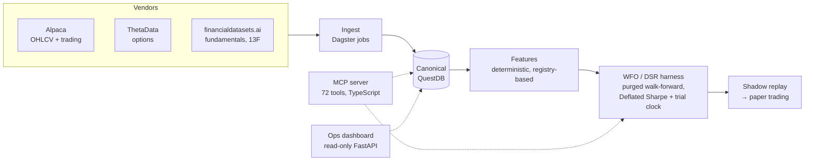

# YATS — Yet Another Trading System

YATS is a trading research platform whose referee keeps saying **no**. It runs the full loop — multi-vendor ingestion, canonical data plane, deterministic features, walk-forward training and evaluation, shadow replay, paper execution — but the part it takes most seriously is the certification gate: honest next-bar execution, purged walk-forward optimization, and a Deflated Sharpe Ratio test with a **public trial clock** that counts every configuration ever tried against every new result. After 63 logged trials across PPO, supervised, feature-ablation, and risk-overlay sweeps, nothing has crossed the bar yet. The negative results are published in-repo, because a platform that can't say "no signal" rigorously can't be trusted when it eventually says "yes."

## Quickstart (no API keys needed)

```bash
git clone <this repo> && cd yats
make demo
```

`make demo` replays the bundled `demo/` dataset through the research harness — feature computation, a small purged walk-forward sweep, and a Deflated Sharpe verdict — with no vendor credentials required. See [Setup with real data](#setup-with-real-data) to plug in live vendors.

Run the test suite (no services required — live-DB tests skip automatically):

```bash
PYTHONPATH=.:pipelines uv run --with pytest --with pytest-timeout \
  pytest tests -q --timeout=120 -k "not live"
```

1,716 tests collected; 1,684 run without live vendors/DB.

## Architecture



- **Raw → canonical**: every vendor write is append-only raw; only reconciled canonical tables (with lineage) feed anything downstream.
- **Honest execution**: signals computed on bar *t* fill at bar *t+1* (`fill_timing`: next_close or next_open) — no same-bar fills.
- **Purged WFO**: anchored expanding folds with purge = label horizon plus a feature-memory buffer, so no training fold sees leaked future data.
- **Deflated Sharpe with a trial clock**: every config in every sweep increments a cumulative trial count; DSR deflates each new result against the whole history. Current clock: **63 trials** ([docs/research/full_span_verdicts.md](docs/research/full_span_verdicts.md)).
- **MCP-native**: all capabilities are exposed as MCP tools callable by agents or notebooks; a read-only [dashboard](docs/dashboard.md) sits alongside.

## Results (the honest table)

**Best certified alpha: none.** The certification bar is DSR ≥ 0.95 after deflation over all trials ever burned.

| Sweep | Question | Best result | Verdict |
|---|---|---|---|
| [2d — first WFO sweep](docs/research/wfo_sweep_2d_results.md) | Real alpha in the signal set with PPO? | DSR 0.645 | No |
| [3d — insider/institutional A/B](docs/research/wfo_sweep_3d_results.md) | Do insider features help? | Enriched arm uniformly worse; DSR 0.835 | No |
| [4b — regime_v2 3-arm](docs/research/wfo_sweep_4b_results.md) | Do market-implied regime features help? | Worse overall, better final fold; DSR 0.770 | No — extractor is the bottleneck |
| [ALPHA-1 — supervised track](docs/research/wfo_sweep_alpha1_results.md) | Ridge/LightGBM vs PPO? | Sharpe 1.68 on the short span; DSR 0.885 | No |
| [Full-span re-verdicts, honest execution](docs/research/full_span_verdicts.md) | Do results survive 6.5 years + next-bar fills? | lgbm_21d: OOS Sharpe 0.905, DSR 0.943 | No |
| [Vol-targeting overlay on lgbm_21d — trial 63](docs/research/full_span_verdicts.md) | Does the ALPHA-3 risk layer lift DSR? | **OOS Sharpe 1.134, strict DSR 0.921 vs the 0.95 bar** | Closest yet — still no |

Trial clock at last verdict: **63 trials burned**. Nothing is certified; the closest attempt sits at DSR 0.92 against the 0.95 bar. On trial 63 a naive 3-trial benchmark printed DSR 0.988 — and was rejected in favor of the strict computation deflated over all 63 trials, which is exactly the self-flattering shortcut the public trial clock exists to prevent (see the addendum in [full_span_verdicts.md](docs/research/full_span_verdicts.md)).

An earlier era of Sharpe ≈ 2.17 results on a 2-year window died under span extension and honest fills — that post-mortem is in the full-span verdicts doc. The docs above are kept as a **lab notebook**: dated, immutable, and linked from every claim.

## Setup with real data

Full vendor setup, the one-command symbol backfill, and the raw → canonical pipeline are documented in [docs/ingestion.md](docs/ingestion.md).

```bash
cp .env.example .env       # fill in vendor keys (Alpaca, ThetaData, financialdatasets.ai)
docker compose up -d       # QuestDB
python scripts/bootstrap_db.py
PYTHONPATH=.:pipelines uv run python -m yats_pipelines.backfill \
    --symbols NFLX,AMD --start 2020-01-01
```

Reference material:

- [docs/REFERENCE.md](docs/REFERENCE.md) — MCP tool catalog, QuestDB schemas, config reference
- [docs/ingestion.md](docs/ingestion.md) — ingestion architecture and backfill runbook
- [docs/dashboard.md](docs/dashboard.md) — read-only operations dashboard
- [docs/your_first_experiment.ipynb](docs/your_first_experiment.ipynb) — general-audience walkthrough: run your first experiment
- [docs/yats_for_quanto_users.ipynb](docs/yats_for_quanto_users.ipynb) — notebook walkthrough for quant researchers
- [configs/risk.yml](configs/risk.yml) — the static risk contract (no model may override it)

## Roadmap (not yet built)

None of the following exists today; no dates are promised.

- **v1.1 — external LLM policies over MCP**: let external agents propose allocations through the MCP tool surface, subject to the same risk contract and certification gate as any other policy.
- **Universe expansion**: beyond the dev10 development universe toward the full S&P 500 list already in `configs/universes/`.
- **Live trading**: the execution layer and kill switches exist and are paper-tested; live capital waits on a certified policy — i.e., on the referee finally saying yes.

## Contributing

See [CONTRIBUTING.md](CONTRIBUTING.md) — dev setup, test commands, and the no-lookahead discipline every PR is held to.

## License

[MIT](LICENSE) — copyright YATS contributors.
